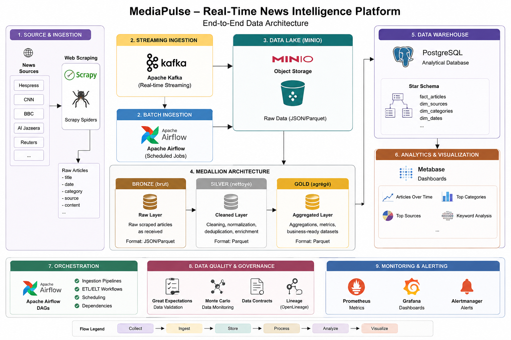
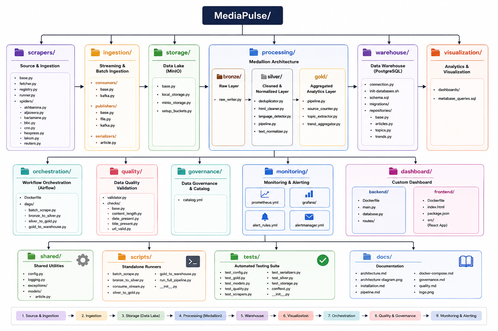
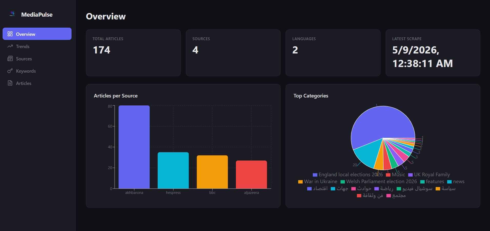

<p align="center">
  
</p>

<h1 align="center">MediaPulse</h1>

<p align="center">
  Plateforme Big Data de collecte et d'analyse d'articles de presse pour identifier les tendances médiatiques.
</p>

## Architecture



**Architecture Médaillon (Bronze / Silver / Gold)** sur MinIO, orchestrée par Airflow, monitorée par Prometheus + Grafana.

## Structure du projet



## Dashboard



## Sources d'actualité

| Source | Type | Langue |
|--------|------|--------|
| Hespress | Marocain | AR |
| Akhbarona | Marocain | AR |
| Lakom | Marocain | AR |
| Barlamane | Marocain | AR/FR |
| Al Jazeera | International | EN |
| BBC News | International | EN |
| CNN | International | EN |
| Reuters | International | EN |

## Stack technique

| Couche | Technologie |
|--------|-------------|
| Scraping | Python + BeautifulSoup |
| Streaming | Apache Kafka + Zookeeper |
| Data Lake | MinIO (S3-compatible) |
| Traitement | Python |
| Orchestration | Apache Airflow |
| Data Warehouse | PostgreSQL |
| Visualisation | Metabase |
| Monitoring | Prometheus + Grafana |
| Déploiement | Docker + docker-compose |

## Démarrage rapide

### Prérequis

- Docker + Docker Compose
- Git

### Installation

```bash
git clone https://github.com/wizli595/mediapulse.git
cd mediapulse
cp .env.example .env
docker compose up -d --build
```

### Lancer le pipeline complet

```bash
docker compose run --rm full-pipeline
```

### Lancer les étapes individuellement

```bash
docker compose run --rm batch-scraper      # 1. Scraping → Bronze → Kafka
docker compose run --rm bronze-to-silver   # 2. Bronze → Silver
docker compose run --rm gold-aggregator    # 3. Silver → Gold
docker compose run --rm warehouse-loader   # 4. Gold → PostgreSQL
```

### Vérifier les données

```bash
docker exec mediapulse-postgres psql -U mediapulse -d mediapulse \
  -c "SELECT source, COUNT(*) FROM articles GROUP BY source ORDER BY count DESC;"
```

## Accès aux interfaces

| Service | URL | Identifiants |
|---------|-----|-------------|
| Dashboard | http://localhost:3000 | — |
| Dashboard API | http://localhost:8000 | — |
| Airflow | http://localhost:8080 | `admin` / `admin` |
| Metabase | http://localhost:3002 | Assistant de configuration |
| MinIO Console | http://localhost:9001 | `mediapulse` / `changeme123` |
| Grafana | http://localhost:3001 | `admin` / `admin` |
| Prometheus | http://localhost:9090 | Pas d'authentification |

### Configuration Metabase

Au premier lancement, ajouter la base de données :
- Type : PostgreSQL
- Host : `postgres`
- Port : `5432`
- Database : `mediapulse`
- User : `mediapulse`
- Password : `changeme123`

## Tests

```bash
python -m venv venv
source venv/Scripts/activate   # Windows
pip install -r requirements-dev.txt
PYTHONPATH=. pytest tests/ -v
```

56 tests couvrant tous les modules.

## Documentation

Voir le dossier [`docs/`](docs/) pour la documentation détaillée :

- [Architecture](docs/architecture.md) — Couches, flux de données, choix techniques
- [Installation](docs/installation.md) — Guide d'installation pas à pas
- [Pipeline](docs/pipeline.md) — Fonctionnement du pipeline de bout en bout
- [Docker Compose](docs/docker-compose.md) — Description de chaque service
- [Qualité des données](docs/quality.md) — Checks et dimensions de qualité
- [Gouvernance](docs/governance.md) — Catalogue, lignage, traçabilité

## Licence

Projet académique — Architecture de données.
